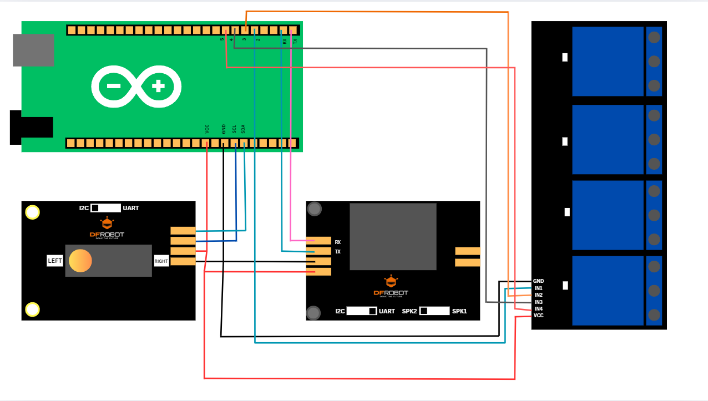

# MakerSpace Internship Report: An Arduino Voice Controlled Lighting System

## Introduction
As part of the MakerSpace internship, we are asked to decide on a project that makes use of Arduino, an open-source electronics platform. These introductory project aims to introduce veteran as well as beginner robotic enthusiasts to learn about its intricacies and capabilities.

The Voice Controlled Lighting System is a great project to learn about the connection between hardware and software and how they complement each other in order to improve our daily lives, i.e. via home automation (Amazon Alexa, Google Home).

## Project Description
With this project, we will create a lighting system (a lightbulb and an led) that can be turned on and off with just our voice.

- Objective:
    - Turn a lightbulb and an led on and off with voice commands

- Inspiration:
    - Due to my daily use of an Amazon Alexa in order to verify the weather and play music by the simple act of vocally asking the questions, I was inspired to discover how such a machine could operate. 

    When searching Arduino Projects, I stumbled upon a project that had home-automation as its base idea and I built the idea off of it.

- Planning:
    - A majority of the planning went into figuring out the required voice recognition sensor needed.

## Implementation
Following a previously made Arduino project regarding home automation, I traced the steps required for the lighting system.

- Hardware Setup:
    - Arduino Uno
    - DFRobot Voice Recognition Sensor (or a voice recognition module of your choice)
    - Relay Modules (can depend on how many lightbulbs or other gadgets used)
    - Any Colour LED
    - Any Lightbulb
    - Jumper Wires
    - Breadboard
    - Power Supply (connected to Mac)

- Wiring Scheme:


In words:
### Voice Recognition Module:
- **VCC** → Arduino 5V  
- **GND** → Arduino GND  
- **TX**  → Arduino Pin D6 (SoftwareSerial RX)  
- **RX**  → Arduino Pin D7 (SoftwareSerial TX)  
- **Mode Switch** → Set to **UART**

### Relay Module & Lamp:
- **VCC** → Arduino 5V  
- **GND** → Arduino GND  
- **IN**  → Arduino Pin D8  
- **COM** → +5 V rail on breadboard  
- **NO**  → Lamp “+” lead  
- **Lamp “–” lead** → GND rail on breadboard  

### Red LED:
- **Anode** (long leg) → 220 Ω resistor → Arduino Pin D3  
- **Cathode** (short leg) → Arduino GND  

- Software Development:
    - A heavy part of the coding process was understanding how the used voice recognition module worked and how it understood the commands (via given unique command IDs). 
    - The required libraries are DFRobot_DF2301Q.h (need to install via library) and SoftwareSerial.h (included).

- Sensor Documentation:
    - DFRobot Voice Module
        - Function: The sensor has 121 fixed command IDs and programmable custom commands. The module also has a built-in speaker and microphone. It functions by activating it with the default
        command wake word "Hello Robot" and then it begins actively listening for a voice command. If the vocal instruction is part of the fixed commands or is a learnt one, the specific ID is returned.

```arduino
  void loop() {
    uint8_t cmd = asr.getCMDID(); // get the recognized id

// switch case to handle the different IDs
    switch (cmd) {
      case 103:  // built-in command for the sensor
        Serial.println("→ LIGHT ON (103)");
        digitalWrite(RELAY_PIN, HIGH);   // energize relay → bulb turns on
        break;

      case 104:  // built-in “Turn off the light”
        Serial.println("→ LIGHT OFF (104)");
        digitalWrite(RELAY_PIN, LOW);    // de-energize relay → bulb turns off
        break;

      case 5:  // learnt command french version of lights on
        Serial.println("→ LUMIERE ALLUME (5)");
        digitalWrite(RELAY_PIN, HIGH);   // same as case 103
        break;

      case 6:  // learnt command french lights off
        Serial.println("→ LUMIERE ETEINT (6)");
        digitalWrite(RELAY_PIN, LOW);    // same as 104
        break;
      
      case 7: // added red led function on
        Serial.println("→ RED LED ON (7)");
        digitalWrite(RED_LED_PIN, HIGH);    // changes low to high, led on 
        break;

      case 8: // added red led function off
        Serial.println("→ RED LED OFF (8)");
        digitalWrite(RED_LED_PIN, LOW);    // turns it back off
        break;

      default: // gives the id for the unrecognized command, debugging tool
        if (cmd != 0) {
          Serial.print("Unknown CMDID = ");
          Serial.println(cmd);
        }
        break;
    }

    // avoid serial spam
    delay(200);
  }
```
## Results
The project seems to be a relative success as we can vocally turn on and off the lights under the proper circumstances. 

Per observation and the limiting factor of the module, the commands seem to be recognized and executed when the speaker is withing distance (accuracy drops after 30 cm) and when there is little noise. Furthermore, it had a harder time differentiating the learnt commands when done in another language, often mixing up one and the other. 

## Discussion and Conclusion
In short, the project allowed for me to learn furthermore about Arduino and the world of electronics. It allowed me to further understand the process behind hardware and software and how the modern machinery operate at such a high level on a daily basis. 

The mechanical aspect of building the system did not prove to be too difficult. However, my wiring was not the most optimal and it turn it perhaps caused some unstable connection issues at time. Other than that, a majority of the troubles came from the coding of the voice sensor as it took a while to be able to properly recognize and return the correct command ID. 

In addition to this, the learning process for the custom commands were strenuous. I had difficulty learnt the inaccuracy between saying similar commands in French and had realized that it would mix up one and the other. As a result, I simply had to come up with clear and distinct phrasing for the opposite commands to easily receognize. 

- Improvements:
    - A more stable wiring scheme
    - Implementing a battery system
    - Integrating higher voltage devices (e.g. fans, motors, more bulbs)
    - Reduce the inaccuracy due to noise (Noise Filtering)

## References
- https://projecthub.arduino.cc/rohan_barnwal/wave-speak-control-the-future-of-smart-homes-is-here-d5bc55
- https://wiki.dfrobot.com/SKU_SEN0539-EN_Gravity_Voice_Recognition_Module_I2C_UART#target_9
- https://www.youtube.com/watch?v=qSqbq6sm4rQ&t=1s

## Acknowledgements
- I wish to thank Joel Trudeau for the mentorship, the opportunity, and the patience as well as the continuous understanding / support over the semester when working on such an educative project. This internship is a wonderful opportunity for many to learn, I was glad to have been part of it.

## Project in Action


→ The video file is unable to be shown, please follow the link to download the live demo or find it in the /project demo/ folder at the top of the repository!


## Repository Link:
https://github.com/KerbyGit/Voice-Light-Arduino 